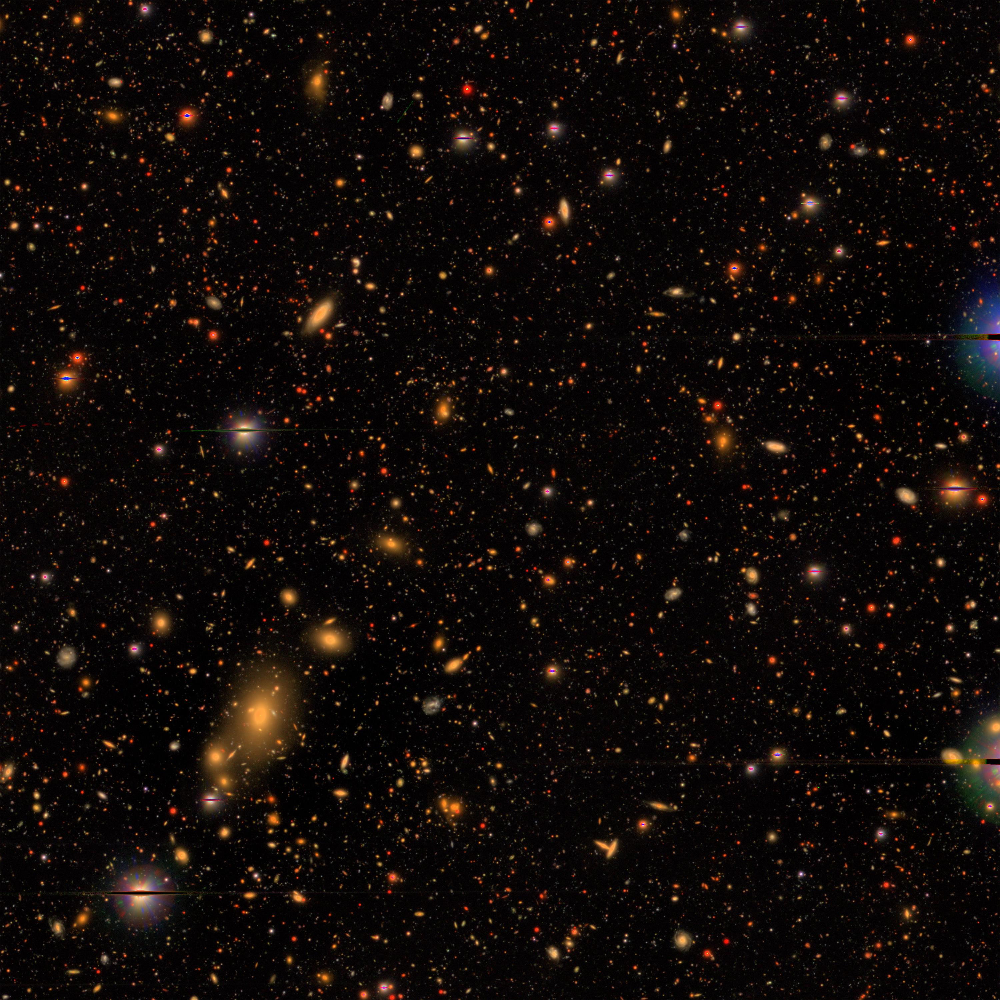

# Sky Embeddings

Welcome to the Sky Embeddings repository, where we leverage self-supervised learning to generate and utilize embeddings from sky images for tasks such as classification, redshift estimation, and similarity searches.

## Overview

This repository hosts code and methodologies for applying Masked Image Modelling (MIM) to astronomical images, focusing on producing high-quality embeddings that capture the rich, underlying structures of the universe.

### Related Work on Masked Image Modelling

We combined aspects from the [MAE code developed by Facebook AI](https://github.com/facebookresearch/mae) and the [SimMIM Framework for Masked Image Modeling](https://github.com/microsoft/SimMIM) as our primary machine learning pipeline. Leveraging these developments with a few tricks of our own allowed us to create meaningful embeddings from observations of the sky.

### Dependencies

Ensure you have the following installed:

- Python 3.11.5
- PyTorch: `pip install torch==2.0.1`
- h5py: `pip install h5py`
- Scikit-learn `pip install scikit-learn`

  

## Dataset: Hyper Suprime-Cam (HSC) - Subaru Telescope

Our primary dataset comes from the Hyper Suprime-Cam (HSC) on the Subaru Telescope. Below is an example image from the HSC:

   
  <a href="https://subarutelescope.org/en/news/topics/2017/02/27/2459.html">subarutelescope.org</a>

### Data Download

Details on how to access and prepare the HSC data will be provided soon.

  

## Masked Image Modelling

You can train the network using one of the following methods:

### Training Option 1: Local Training

1. Set model architecture and parameters using a configuration file in [the config directory](./configs). Duplicate the [original configuration file](./configs/mim_32.ini) and modify as needed.
2. To train a model with a new config file named `mim_2.ini`, use `python pretrain_mim.py mim_2 -v 5000 -ct 10.00`, which will train your model displaying the progress every 5000 batch iterations and the model would be saved every 10 minutes. The script will also continue training from the last save point.

### Training Option 2: Compute Canada Cluster

For those with access to Compute Canada:

1. Modify the [load modules file](./cc/module_loads.txt) to load the necessary environment.
2. To launch training with a modified batch size or other parameters, use `python launch_pretraining.py mim_2 -bs 32` from the `sky_embeddings/cc/` directory. This script automatically creates a new configuration and initiates multiple training jobs. You can checkout the other parameters that can be changed using the command `python cc/launch_pretraining.py -h`.

### Evaluation

During training, several types of figures will be created to track the progress. 

The [evaluation metrics will be plotted](./figures/mim_1_progress.png), which includes the loss values for the training and validation data. If `lp_class_data_file` and/or `lp_regress_data_file` are provided in the training configuration, this plot will also include the results of a simple linear probing technique, which only takes a couple seconds to train. This allows us to track how effectively our embeddings can be used to classify (stars, qsos, and galaxies) and predict redshift of galaxies. Both linear probing models are trained on only 4.8k images and validated using 1.2k images.

Additionally, some of the masked image modelling results will be plotted throughout training, similar to [this one](./figures/mim_1_1000000iters.png).

  

## Downstream Task: Similarity Search

Checkout the [similarity search](./similarity_search.py) script and this [example bash script](./scripts/done/sim.sh) for guidance on how to perform the similarity search. This will produce some files in a `sky_embeddings/results` directory as well figures showing some of the top matches from the similarity search, similar to [this figure](./figures/mim_1_HSC_dwarf_galaxies_GRIZY_64_new_simsearch_results.png).

  

## Downstream Task: Predicting Redshift

You can attach a linear head onto the network embeddings to fine-tune the model, perform linear-probing, or train the network from scratch in a fully supervised manner by using one of the following two options (similar to the masked image modelling):

### Training Option 1: Local Training

1. Set model architecture and parameters using a configuration file in [the config directory](./configs). Duplicate the [original configuration file](./configs/lp_1.ini) and modify as needed.
2. To train a model with a new config file named `lp_2.ini`, use `python train_predictor.py lp_2 -v 2000 -ct 10.00`, which will train your model displaying the progress every 5000 batch iterations and the model would be saved every 10 minutes. The script will also continue training from the last save point.

### Training Option 2: Compute Canada Cluster

For those with access to Compute Canada:

1. Modify the [load modules file](./cc/module_loads.txt) to load the necessary environment.
2. To launch training with a modified batch size or other parameters, use `python launch_predictor.py lp_2 -bs 32` from the `sky_embeddings/cc/` directory. This script automatically creates a new configuration and initiates multiple training jobs. You can checkout the other parameters that can be changed using the command `python cc/launch_predictor.py -h`.

### Evaluation

During training, the training progress will be tracked similar to the pretraining.

After training, you can also use `python test_predictor.py lp_2` to perform predictions on the validation set and produce plots like [this one](./figures/lp_1_redshift.png). If you used option 2 above for training, this will be done automatically once the training is finished.

  

## Contribution and Support

We welcome contributions and suggestions! Please raise issues or submit pull requests on GitHub for any features or problems. For support, refer to the repository's issues section or contact the maintainers directly.

---

Embark on a journey of exploring the universe with machine learning through Sky Embeddings!
